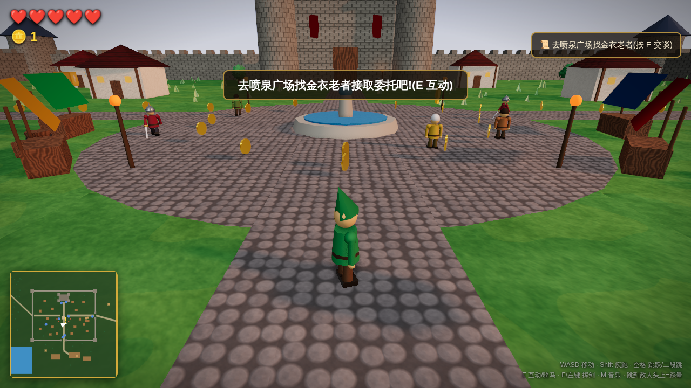
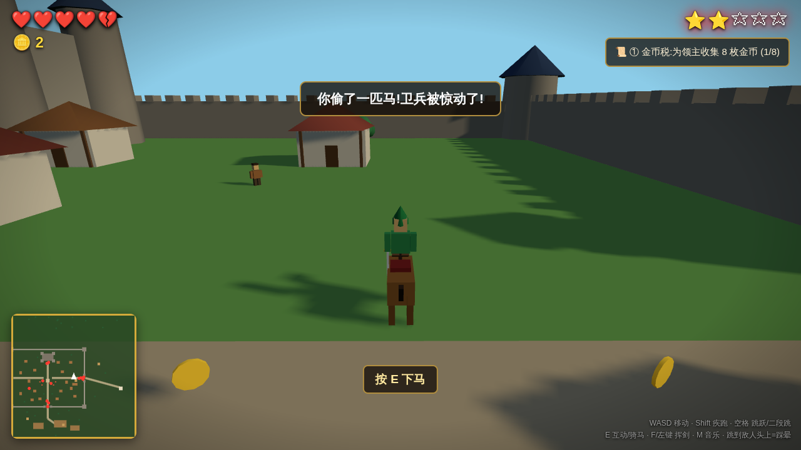

# 🏰 侠盗猎马人:中世纪王国
### Grand Theft Horse: Medieval Kingdom

一个**GTA 式开放世界 × 中世纪 × 任天堂玩法**的缝合怪浏览器 3D 游戏。
纯 Three.js 打造,零外部资源,开箱即玩。

> **王国历 847 年。** 艾尔德里亚王国饱受狼灾与「黑石兄弟会」盗贼团之苦,
> 年迈的领主奥德里克重金悬赏四方豪杰。你——绿帽游侠林恩,踏进了王都拉文霍德……





## 🎮 立即游玩

**网页版**(零依赖):
```bash
python3 -m http.server 8000    # 仓库根目录
# 浏览器打开 http://localhost:8000
```

**桌面版**(独立窗口,可打包成 exe/dmg/AppImage 文件):
```bash
npm install     # 首次安装 Electron
npm start       # 启动桌面版(F11 全屏)
npm run dist    # 打包成可分发的安装文件(输出在 dist/)
```

Three.js 已内置在 `lib/` 中,游戏本体完全离线可玩。

## 🗺️ 这是个什么游戏?

| 灵感来源 | 缝进了什么 |
|---|---|
| **GTA** | 第三人称开放世界、**偷马**(有主的马会引来通缉)、⭐ 1–5 星通缉系统、卫兵追捕与增援、逃脱洗白、被捕没收一半金币、任务链、小地图、昼夜循环 |
| **中世纪** | 环形城墙王国、城堡主堡、村庄民居、集市摊位、马厩、风车磨坊、农田、西部森林、湖泊、盗贼营地、夜间火把 |
| **任天堂** | 塞尔达式 ❤️ 心心血量与绿帽勇者、马里奥式金币/二段跳/**踩头攻击**、可顶碎的 **? 砖块**、宝箱、力量之星通关、8-bit 芯片音乐与音效 |

## 🕹️ 操作

| 按键 | 动作 |
|---|---|
| `W A S D` | 移动 |
| `Shift` | 疾跑 / 策马狂奔 |
| `空格` | 跳跃(支持二段跳;骑马也能跳) |
| `E` | 骑马 / 偷马 / 与委托人对话 / 开宝箱 / 下马 |
| `F` 或 `鼠标左键` | 挥剑 |
| `M` | 开关背景音乐 |
| 鼠标 | 转动视角(点击画面锁定指针) |

## 🗺️ 100000 × 100000 的艾尔德里亚(20+ 命名区域 + 无尽程序化荒野)

**手工核心 20 区**(进入时 GTA 式大字浮现):
拉文霍德王都 · 王城广场 · 翡翠农田 · 十字路旅店 · 磨坊郊野 · 先祖石环 · 哨塔遗迹 ·
苇岸渔村 · 银月湖畔 · 幽暗森林 · 黑石要塞 · 静眠墓园 · 北境群山 ·
**三石村**(南境小村,三位新村民)· **琥珀荒漠**(仙人掌与方尖碑)·
**雾语沼泽**(黑水潭与女巫玛尔戈的回魂汤铺)· **灰烬荒地**(古战场断剑白骨 + 常驻匪帮)·
**龙骨之地**(巨龙肋骨拱与头骨)· **迷途丘陵**(圆丘迷阵)· **霜风隘口**(雪松冰湖)

**核心之外:±50,000 的程序化无尽荒野**(总幅面 100000×100000)。
128×128 区块随玩家动态加载/卸载,同一坐标永远生成同样的景物(坐标哈希做种):
四大生物群系(🌿 苍绿平原 / 🌲 茂密林海 / 🏜️ 金色瀚海 / ❄️ 白霜旷野,按方位命名
"东境·茂密林海"式区域浮现),**11 种荒野兴趣点**按群系分布:
废弃营地 · 无名石碑金币环 · 🐺 狼群窝 · 🐴 **野马群**(骑上就是你的!)· 🐑 野羊群 ·
⚔️ **盗贼窝点**(黑帐篷守着一堆金币)· ⛺ 猎人营地(有回血心)· 🗼 废弃哨塔 ·
🍄 蘑菇圈 · 💎 群系水晶 · 迷你石阵。区块卸载时野外生物随之收走,永不泄漏。
骑马向任一方向狂奔十分钟,风景仍在变化。

## 📅 历法:季节与日子

一天 240 秒,**六日为一季,四季轮转**(HUD 右下角:"🍂秋·3日·满月夜 🌞 ☀️"):
- 🌸 **春** → ☀️ **夏**(草色浓绿)→ 🍂 **秋**(草皮转金黄)→ ❄️ **冬**
  (**大地积雪**、草结白霜、降雨变成**漫天雪花**——雪落无声,雷暴变暴风雪)
- 每天拂晓天亮时换日报时("🌅 秋·第 1 日,秋天来了")
- **定日节庆**(按历法过日子,不再是乱糟糟的随机):
  - 每季第 2 日 **集市日**——喷泉广场满地赶集人掉的金币
  - 每季第 3 日 **满月夜**——钓鱼收益 ×2,午夜幽灵更常现身
  - 每季第 5 日 **狼月**——黄昏预警,入夜狼群提速加伤、死后速刷
  - 秋季第 1 日 **丰收节**——三块农田落满金币
- 游戏日随存档保存,读档回到当天

## 📜 八章主线委托(管家埃隆处接取)

① 金币税 → ② 皇家快递(限时投递)→ ③ 农场竞速(顺序穿越 6 个金环)→
④ 剿灭盗贼 → ⑤ 迷途的白马(找回并获得爱驹「雪影」)→ ⑥ 护送商队(路遇埋伏)→
⑦ 狼灾(猎狼)→ ⑧ 黑石要塞(Boss 战:血斧巴罗克)

通关后领取 **★ 力量之星 ★**,再去谒见领主领取重赏。

## 👥 活着的王国(RDR2 式 NPC 生态)

**19 位村民全部有名有姓、有家有业有心事**——面包师汉娜在等失踪的丈夫、
老兵格雷姆在北境战役丢了一条腿、守墓人莫格夜里见过怪事、学徒皮普梦想打出斩龙剑……
每个人有 4-6 句独有对话(按 E 面对面交谈,多页对话面板)。

**每个人都有自己的一天**(跟随游戏内昼夜):
- 🌅 清晨在家门口洗漱晃悠 → 🌞 白天各奔工作岗位(摊贩守摊、农夫下田、
  渔夫上栈桥、磨坊主去磨坊、守墓人去墓园)→ 🌇 黄昏聚到旅店与广场 →
  🌙 夜里走回家睡觉,街道空无一人(卫兵仍在巡逻)
- 具名 NPC 同样有日程:铁匠白天守炉、黄昏去旅店喝酒;管家埃隆夜里回城堡

**六位主角级 NPC 拥有多章节个人故事线**,随主线推进解锁新对话:
铁匠格罗姆的黑石要塞奴隶烙印、老板娘罗莎死于狼口的丈夫、
领主奥德里克与亡妻的爱驹、渔夫老周的湖心传说……

**📚 211 万字对话库**(`src/dialogue-db.json`,21,000+ 行):26 位角色
每人 800+ 句台词,按**时辰 × 天气 × 主线进度**动态挑选,近期说过的不复读——
他们会互相八卦(猎户议论铁匠的烙印、洗衣妇议论卫兵队长的披风)、聊 36 条世界传闻、
评点 12 个地区、议论你的最新事迹、回忆往事、讲人生谚语,每句都带人物专属的
口头禅与动作神态。由 `tools/gen-dialogue.mjs` 生成(手写素材库 × 声线 × 情境组合),
可随时扩充再生成。
- **花钱的地方**:铁匠 50 金币升级陨铁剑(伤害翻倍)· 马贩 80 金币购买皇家骏马「疾风」
  (快 20%,合法拥有)· 旅店 10 金币回满生命并睡到清晨
- **收集**:10 枚 🛡️ 皇家纹章散落在遗迹/墓园/石环/渔村等地,集齐奖励 100 金币
- **存档**:进度(金币/任务/纹章/升级)自动保存到浏览器,关掉重开继续玩;
  标题画面按 Delete 清档重开

## 🐔 无意义但快乐(GTA 精髓)

- **鸡是这个王国真正的主宰**:可以打(它不会死,但会记仇——惹三次召唤**复仇鸡群**
  追杀你)、可以**抱起来举过头顶**、抱着跳崖**扑腾缓降**、还能**扔出去砸卫兵**
  (算袭警,一星通缉)或砸村民(不算犯罪,算没品)
- **骑羊**:速度感人、一路咩咩叫、视角贴地,毫无意义,强烈推荐
- **麦酒**(旅店 2 金币):镜头摇晃、走路画龙、打嗝 25 秒
- **喷泉许愿**(1 金币):九种随机结果,大多毫无意义,偶尔湖神打喷嚏还你十枚
- **搞笑 NPC**:赌鬼豆子(掷骰子赌 10 金币)、吟游诗人皮波(**按你的真实事迹即兴
  打油诗**——偷过马、通缉几星、杀过几头狼全被编进歌里)、疯子老糊涂(第四面墙
  预言:"太阳每四分钟绕一圈,这合理吗?!")、风车骑士唐豆(与风车决斗三年,
  每 3 秒真的挥剑)
- **8 个无意义成就**:禽兽行为(扔鸡×10)、鸡下败将、第二位风车骑士、许愿池钉子户、
  酒中豪杰、赌怪(连输 3 把)、羊骑士(骑羊 100 米)、弹簧靴(连环踩踏)——全部持久化

## 🎬 事件导演:永无止境的随机事件

事件导演每 90~160 秒从事件池按**权重 × 条件**(时辰/位置/主线进度)抽一个
在你身边上演;**每日事件限额 4 件**(与街头事件共享),节奏张弛有度、不再乱成一团,
第二天拂晓限额刷新:

🐺 狼群突袭居民(救人 +20)· 🗡️ 路霸劫道("留下买路钱!")· 🤺 流浪剑客卡洛邀你
决斗(胜 +20)· ⛓️ 逃犯越狱(追捕 +25,跑远了就没了)· ☄️ **夜空流星坠落**
(轰然砸出弹坑,散落灼热金币)· 🧙 神秘兜帽商人(限时 45 秒,5 金币灵药,买完
一阵烟消失)· 👻 午夜幽灵(靠近即消散,留一把古币)· 🐔✨ **金鸡出没**(追上抱住
化作 30 金币)· 🐔 鸡群无端暴动 · 💨 怪风撒钱——加上原有的街头抢劫与惊马,
加上原有的街头抢劫与惊马,以及创作代理新设计的:🐄 **会点头的智慧牛**(向它连问五个问题)、
🌠 **流星雨之夜**(星屑落野限时拾取)、🐔💨 **越狱的烤鸡**(抓住送还伙计小马)、
🤫 **许愿池捞币人**(咳嗽一声吓他一跳)——**16 种事件无限轮换**。竞技场比赛期间导演自动停手。

## 🤖 运行时 AI 创作(联网时)

- **王国公告牌**(喷泉广场):每天拂晓由 AI 以王室传令官的口吻现写一则当日公告
  (知道今天的季节、节庆、天气和你的功绩);离线时用 35 条内置官腔轮换
- **盲眼说书人苟叔**(十字路旅店):AI 现场即兴编一段三句话的王国怪谈,
  离线回退到 32 个内置话本
- **村民 AI 情境闲聊**:和村民搭话时,后台按"此人身份 × 季节 × 节庆 × 时辰 × 天气"
  预取一句 AI 台词,下次开口就说——零等待,断网无感
- **吟游诗人皮波**的《你的歌》由 AI 按你的实时战绩现场作词,每次都不一样
- **疯子老糊涂**的第四面墙预言也交给 AI 即兴发挥
- 全部走免费无 Key 接口,**断网瞬间回退**到内置台词,游戏永不卡壳

## 🎣 可重复玩法与街头事件

- **猎鹿**:森林与原野游荡着胆小的鹿群,猎到的鹿肉卖给旅店老板娘(5 金币/块)
- **采蘑菇**:林间 14 处蘑菇每天清晨重新长出,采满一篓卖给沼泽女巫(3 金币/朵)
- **世界观铭文**:12 处石碑刻着王国的来历(立国碑/屠龙记/无名将军碑……),集齐解锁成就「史官」
- **墓园漫步**:在静眠墓园按 E 随手读一块墓志铭,14 条铭文有庄重有好笑
- **旅店过夜**:夜里花 10 金币睡到天亮——跳过黑夜、回满生命、直接迎来新一天的节庆

- **钓鱼**:渔村栈桥尽头按 E 抛竿,盯紧提示咬钩瞬间收杆——小鲫鱼/肥鲤鱼/
  银月湖大鱼(15 金币),还可能钓上一只老靴子(老周找了它十年)
- **悬赏板**(南门,无限重复):揭榜后通缉犯("独眼汉斯""瘸腿约里克"……)随机
  藏身森林/遗迹/石环/墓园,光柱指路,击杀领 30 金币,30 秒后新榜再贴
- **街头随机事件**(GTA 式,每隔一两分钟):
  - ⚠️ **盗贼抢劫路人**——赶在他得手逃进森林前击杀,村民塞你 15 金币(成就:见义勇为)
  - 🐴 **受惊的马**满地图狂奔——追上并骑住它,马主人赏 10 金币

## ⚔️ 武器 · 护甲 · 动作

**铁匠铺**(格罗姆处,商店面板):
| 装备 | 价格 | 特点 |
|---|---|---|
| 🗡️ 铁剑 | 初始 | 均衡 |
| 🔪 短匕 | 30 | 出手极快(0.16s 一刀) |
| ⚔️ 巨剑 | 90 | 伤害 3、超远距、击退拉满 |
| 🏹 猎弓 | 60 | **远程射箭**,真实抛物线,箭矢管够 |
| 🔥 淬火陨铁 | 50 | 所有武器伤害 +1,剑刃变金 |
| 🛡️ 皮甲/板甲 | 40/120 | 生命上限 +1❤️/+2❤️,穿在身上看得见 |

**Q** 切换武器(手中模型随之改变)。**动作**:**C 翻滚**(前空翻 + 0.45 秒无敌帧,
可穿越攻击)、**按住右键格挡**(完全免伤,铿锵声 + 减速)、跳劈踩踏、
弓箭可以射狼、射盗贼、射卫兵(算袭警)——甚至射鸡(它会记仇)。

## ⭐ 犯罪与通缉(完整循环)

- **犯罪手段**:偷马 +1 星 · 袭击卫兵/放箭射卫兵 +1 星 · 袭击村民 +2 星 ·
  **G 键当街抢劫**(村民尖叫掉钱,+2 星,同一人 60 秒内不能连抢)· 扔鸡砸卫兵 +1 星
- **通缉后果**:星级越高追兵越多越快(3 星出动红衣皇家骑士);
  **通缉期间铁匠/马贩/旅店全部拒绝服务**(各有台词)
- **洗白途径**:躲开卫兵视线自然消退 · **悬赏板缴罚金**(星级 × 20 金币,立即撕榜)
- **被捕**:在**王都地牢**醒来,罚没一半金币(非通缉死亡仍在喷泉复活)

## 🍄 任天堂式小技巧

跳到卫兵/盗贼/恶狼**头上**能把他踩晕;从下方顶 **? 砖块**爆金币;
野外散落着 8 个宝箱,补心又给钱。低配设备可用 `?lowfx=1` 关闭后处理提升帧率。

## 🎨 AI 生成的照片级贴图(自动)

联网状态下,游戏会**在你的浏览器里自动调用 AI 生图服务(Pollinations,免费无需注册)**,
实时生成 7 种照片级无缝贴图(草地/鹅卵石/石砖/屋瓦/灰泥/木纹/土路)和标题键艺术,
生成完毕后热替换进场景,法线贴图由图像亮度自动推导。

- 首次生成约需 1 分钟,之后自动缓存在本地(Cache API),秒开
- 标题画面会显示生成进度;离线时无缝回退到内置程序化贴图
- 想禁用:打开时加 `?noai=1` 参数

也可以**手动放置自己满意的 AI 素材**:把 Midjourney / SD / DALL·E 生成的无缝贴图放进
`assets/ai/` 目录即可覆盖(优先级最高),每张贴图的现成生图提示词见
[`assets/ai/README.md`](assets/ai/README.md)。

## 🌦️ 动态天气

晴 → 多云 → 雨 → 雷暴随机演变(HUD 右下角显示历法与天气);**冬季降水自动变成雪**:
- 雨天:1100 条风吹雨丝环绕玩家、合成雨声白噪、雾气压近、天光变暗
- 雷暴:闪电白屏 + 震屏 + 延迟雷声轰鸣
- 地面湿润效果:雨中石板/土路/草地变得光滑反光,雨停后恢复
- 细节联动:雨天不再扬尘

## 💨 粒子与音效细节

- 马匹疾驰扬尘、疾跑脚步尘土、重落地/踩踏尘雾
- 马蹄哒哒声随步频变化(走/驰节奏不同)
- 死亡画面复用 AI 生成的键艺术做背景

## 🏃 动作系统

- **人物**:步幅随速度变化的四肢摆动、身体起伏、奔跑前倾、转向侧倾、
  呼吸怠速与头部环视、三段式挥剑(蓄力→劈砍→收势 + 躯干扭转)
- **马匹**:小跑对角步态 / 疾驰步态(前后肢分相、身体俯仰、腾空起伏),
  骑手随马颠簸、疾驰时俯身
- **镜头**:疾跑/疾驰动态拉伸 FOV(速度感)、受击与重落地震屏

## 🔧 技术说明

- **引擎**:Three.js r160(已 vendored 到 `lib/`,无 CDN 依赖)
- **渲染管线**:PBR 物理材质 + ACES 电影级色调映射 + GTAO 环境光遮蔽 +
  UnrealBloom 泛光 + SMAA 抗锯齿 + PMREM 环境反射,4096² 阳光阴影贴图
- **程序化贴图**:草地/鹅卵石/石砖/屋瓦/木纹/灰泥全部运行时生成,
  并由高度场推导法线贴图,零外部资源
- **天空**:自定义 Shader 大气穹顶——渐变散射 + FBM 分形漂移云层 + 太阳光晕,
  随昼夜循环变换黎明/正午/黄昏/星夜
- **植被**:4000 株实例化草丛、顶点扰动的有机树冠
- **音频**:WebAudio 实时合成的 8-bit 音效与中世纪小调 BGM,无音频文件
- **系统**:昼夜循环(太阳/月亮/星空/火把/发光窗户)、简单物理(重力跳跃 + 圆/盒碰撞)、
  状态机 AI(卫兵巡逻→追捕→攻击、村民游荡→逃跑、马匹吃草)、任务状态机、Canvas 小地图

```
├── index.html        # 入口 + HUD + 标题画面
├── lib/three.module.js
└── src/
    ├── main.js       # 主循环、玩家、通缉、任务、HUD、小地图、昼夜
    ├── world.js      # 世界搭建:城堡、城墙、村庄、森林、风车…
    ├── entities.js   # 人形/马匹模型构建器 + 碰撞
    └── audio.js      # WebAudio 芯片音乐合成器
```
