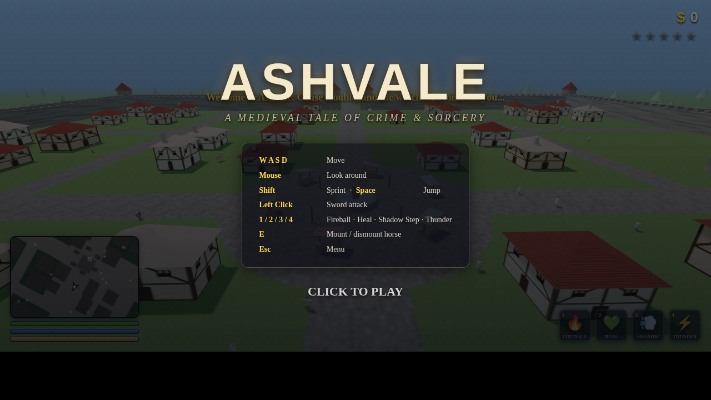
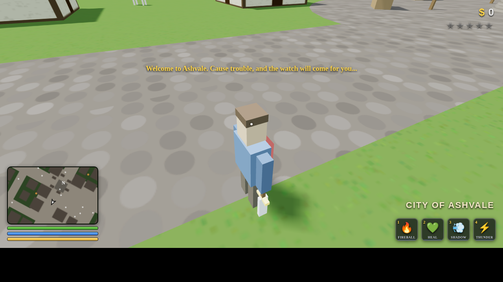

# ASHVALE — A Medieval Tale of Crime & Sorcery

An open-world **medieval action game with GTA-style gameplay**: third-person camera, free-roam city, a wanted system with city guards instead of cops, and horses instead of cars. Built with Three.js — no install, no build step. Just open it in a browser.




## Play

Open `index.html` in any modern desktop browser (Chrome / Edge / Firefox). Everything is bundled locally — it also works completely offline.

```bash
# or serve it locally:
python3 -m http.server 8000
# then visit http://localhost:8000
```

## Features

- **Open world** — a walled medieval city (Ashvale) with a castle, market square, farms, and countryside, populated with wandering peasants, patrolling guards, and horses
- **GTA-style third-person controls** — mouse-look camera, sprint, jump, melee combat
- **Wanted system** — commit crimes and earn up to 5 stars; the city watch will hunt you down. Lay low to let the heat die off
- **Horses as vehicles** — mount any horse with `E`, gallop through the streets (mind the pedestrians)
- **4 castable skills** — with mana costs and cooldowns:
  - `1` **Fireball** — explosive projectile, aimed with the camera
  - `2` **Heal** — restore health
  - `3` **Shadow Step** — blink forward 15 meters
  - `4` **Thunder** — call lightning down on every enemy nearby
- **Day/night cycle** — torches light up at dusk, dawn breaks over the castle
- **GTA-style HUD** — rotating minimap with blips, health/mana/stamina bars, money counter, wanted stars, zone name popups, floating damage numbers
- **Loot** — slain enemies drop gold; dying costs you half of yours

## Controls

| Key | Action |
| --- | --- |
| `W A S D` | Move |
| Mouse | Look around |
| `Shift` | Sprint |
| `Space` | Jump |
| Left click | Sword attack |
| `1` `2` `3` `4` | Cast skills |
| `E` | Mount / dismount horse |
| `Esc` | Menu |

## Tech

- [Three.js](https://threejs.org/) r128 (bundled in `lib/`, no CDN needed)
- All textures generated procedurally at runtime on `<canvas>` — zero image assets
- Static city geometry merged into a handful of draw calls for smooth performance
- Sound effects synthesized live with the Web Audio API — zero audio assets

---

<details>
<summary>中文说明</summary>

一款画面与玩法风格类似 GTA 的中世纪开放世界动作游戏：第三人称视角、自由探索的城市、通缉星级系统（守卫代替警察）、可骑乘的马匹（代替载具），并可施放 4 种技能（火球、治疗、暗影步、雷霆）。直接用浏览器打开 `index.html` 即可游玩，无需安装。

</details>
